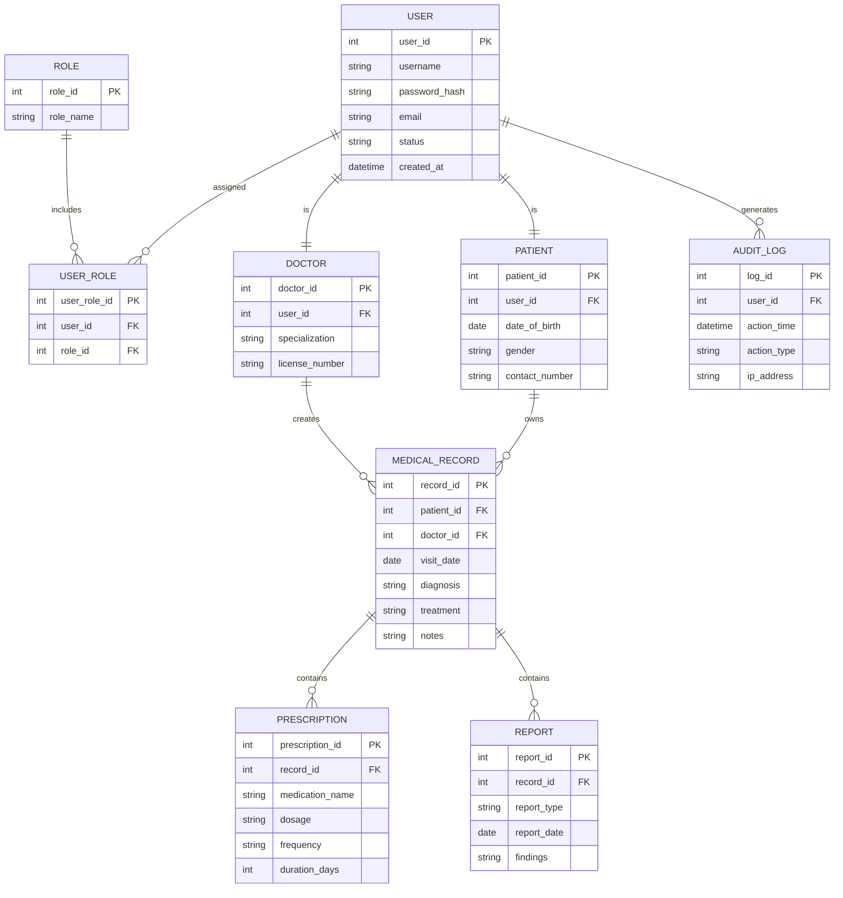

```mermaid
erDiagram
    USER {
        int user_id PK
        string username
        string password_hash
        string email
        string status
        datetime created_at
    }

    ROLE {
        int role_id PK
        string role_name
    }

    USER_ROLE {
        int user_role_id PK
        int user_id FK
        int role_id FK
    }

    DOCTOR {
        int doctor_id PK
        int user_id FK
        string specialization
        string license_number
    }

    PATIENT {
        int patient_id PK
        int user_id FK
        date date_of_birth
        string gender
        string contact_number
    }

    MEDICAL_RECORD {
        int record_id PK
        int patient_id FK
        int doctor_id FK
        date visit_date
        string diagnosis
        string treatment
        string notes
    }

    PRESCRIPTION {
        int prescription_id PK
        int record_id FK
        string medication_name
        string dosage
        string frequency
        int duration_days
    }

    REPORT {
        int report_id PK
        int record_id FK
        string report_type
        date report_date
        string findings
    }

    AUDIT_LOG {
        int log_id PK
        int user_id FK
        datetime action_time
        string action_type
        string ip_address
    }

    USER ||--o{ USER_ROLE : assigned
    ROLE ||--o{ USER_ROLE : includes

    USER ||--|| DOCTOR : is
    USER ||--|| PATIENT : is

    DOCTOR ||--o{ MEDICAL_RECORD : creates
    PATIENT ||--o{ MEDICAL_RECORD : owns

    MEDICAL_RECORD ||--o{ PRESCRIPTION : contains
    MEDICAL_RECORD ||--o{ REPORT : contains

    USER ||--o{ AUDIT_LOG : generates
```
