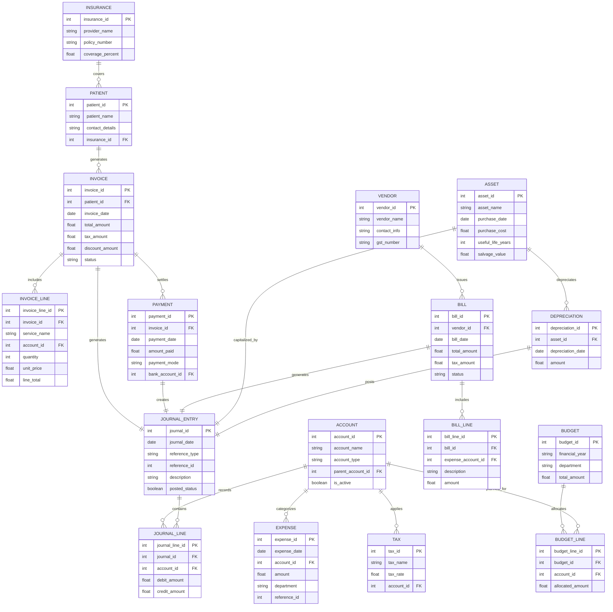

```mermaid
erDiagram

    ACCOUNT {
        int account_id PK
        string account_name
        string account_type
        int parent_account_id FK
        boolean is_active
    }

    JOURNAL_ENTRY {
        int journal_id PK
        date journal_date
        string reference_type
        int reference_id
        string description
        boolean posted_status
    }

    JOURNAL_LINE {
        int journal_line_id PK
        int journal_id FK
        int account_id FK
        float debit_amount
        float credit_amount
    }

    PATIENT {
        int patient_id PK
        string patient_name
        string contact_details
        int insurance_id FK
    }

    INSURANCE {
        int insurance_id PK
        string provider_name
        string policy_number
        float coverage_percent
    }

    INVOICE {
        int invoice_id PK
        int patient_id FK
        date invoice_date
        float total_amount
        float tax_amount
        float discount_amount
        string status
    }

    INVOICE_LINE {
        int invoice_line_id PK
        int invoice_id FK
        string service_name
        int account_id FK
        int quantity
        float unit_price
        float line_total
    }

    PAYMENT {
        int payment_id PK
        int invoice_id FK
        date payment_date
        float amount_paid
        string payment_mode
        int bank_account_id FK
    }

    VENDOR {
        int vendor_id PK
        string vendor_name
        string contact_info
        string gst_number
    }

    BILL {
        int bill_id PK
        int vendor_id FK
        date bill_date
        float total_amount
        float tax_amount
        string status
    }

    BILL_LINE {
        int bill_line_id PK
        int bill_id FK
        int expense_account_id FK
        string description
        float amount
    }

    EXPENSE {
        int expense_id PK
        date expense_date
        int account_id FK
        float amount
        string department
        int reference_id
    }

    ASSET {
        int asset_id PK
        string asset_name
        date purchase_date
        float purchase_cost
        int useful_life_years
        float salvage_value
    }

    DEPRECIATION {
        int depreciation_id PK
        int asset_id FK
        date depreciation_date
        float amount
    }

    TAX {
        int tax_id PK
        string tax_name
        float tax_rate
        int account_id FK
    }

    BUDGET {
        int budget_id PK
        string financial_year
        string department
        float total_amount
    }

    BUDGET_LINE {
        int budget_line_id PK
        int budget_id FK
        int account_id FK
        float allocated_amount
    }

    %% Core Accounting
    ACCOUNT ||--o{ JOURNAL_LINE : records
    JOURNAL_ENTRY ||--o{ JOURNAL_LINE : contains

    %% Patient Billing
    PATIENT ||--o{ INVOICE : generates
    INSURANCE ||--o{ PATIENT : covers
    INVOICE ||--o{ INVOICE_LINE : includes
    INVOICE ||--o{ PAYMENT : settles

    %% Accounting Integration
    INVOICE ||--|| JOURNAL_ENTRY : generates
    PAYMENT ||--|| JOURNAL_ENTRY : creates

    %% Vendor & Payables
    VENDOR ||--o{ BILL : issues
    BILL ||--o{ BILL_LINE : includes
    BILL ||--|| JOURNAL_ENTRY : generates
    ACCOUNT ||--o{ EXPENSE : categorizes

    %% Assets & Depreciation
    ASSET ||--|| JOURNAL_ENTRY : capitalized_by
    ASSET ||--o{ DEPRECIATION : depreciates
    DEPRECIATION ||--|| JOURNAL_ENTRY : posts

    %% Tax
    ACCOUNT ||--o{ TAX : applies

    %% Budgeting
    BUDGET ||--o{ BUDGET_LINE : allocates
    ACCOUNT ||--o{ BUDGET_LINE : planned_for
```
