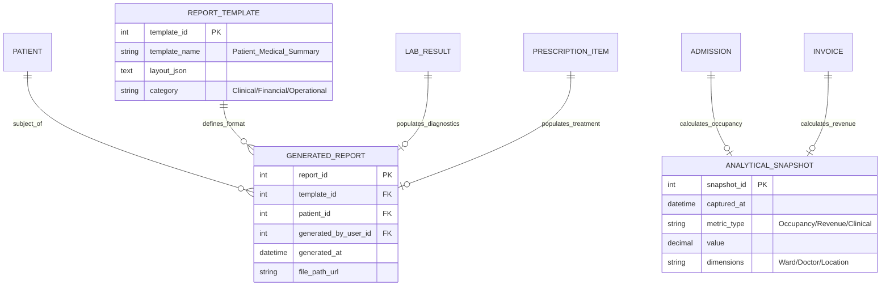

# Reports and Analytics Module – ER Diagram

This module serves as the central intelligence hub, aggregating data from Clinical, Pharmacy, Laboratory, and Financial modules to provide actionable insights.

## ER Diagram

